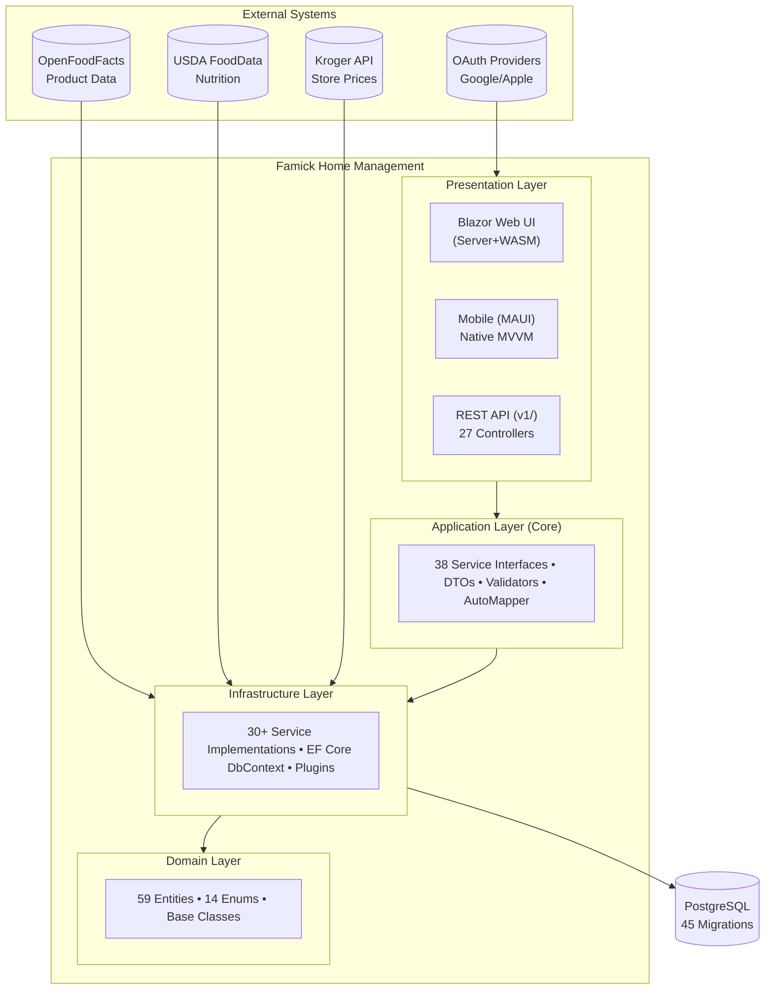
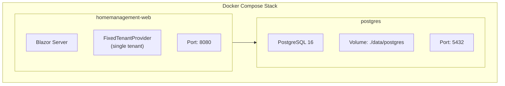
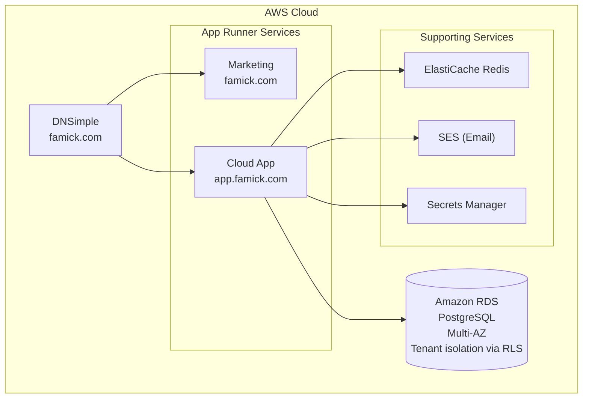
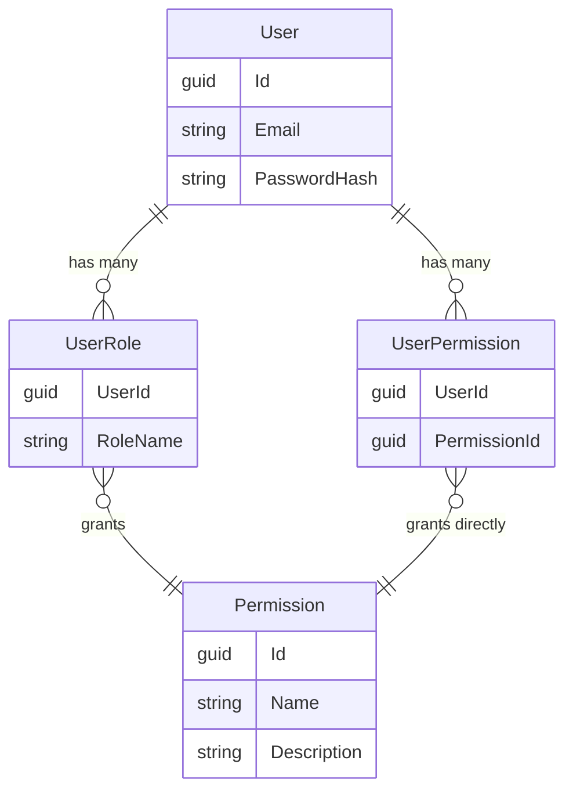

# Famick Home Management - Architecture Documentation

> **Last Updated**: 2026-02-04
> **Version**: 1.0
> **Status**: Active Development (Migration from Grocy PHP/SQLite to .NET 10/PostgreSQL)

---

## Table of Contents

1. [Executive Summary](#1-executive-summary)
2. [System Context Diagram](#2-system-context-diagram)
3. [Repository Architecture](#3-repository-architecture)
4. [Layer Architecture](#4-layer-architecture)
5. [Project Catalog](#5-project-catalog)
6. [Multi-Tenancy Architecture](#6-multi-tenancy-architecture)
7. [API Architecture](#7-api-architecture)
8. [Domain Entity Model](#8-domain-entity-model)
9. [Deployment Architecture](#9-deployment-architecture)
10. [Architecture Decisions & Recommendations](#10-architecture-decisions--recommendations)
11. [Security Architecture](#11-security-architecture)

---

## 1. Executive Summary

### Project Overview

**Famick Home Management** is a comprehensive household management application that helps families track inventory, manage equipment, maintain vehicles, organize shopping, and coordinate household tasks.

### Deployment Models

The application supports two deployment models from a shared codebase:

| Model | Description | License |
|-------|-------------|---------|
| **Self-Hosted** | Single-tenant deployment for privacy-conscious users | Elastic License 2.0 |
| **Cloud SaaS** | Multi-tenant managed service | Proprietary |

### Technology Stack

| Layer | Technology |
|-------|------------|
| **Runtime** | .NET 10 |
| **Database** | PostgreSQL |
| **ORM** | Entity Framework Core 10 |
| **Web Framework** | ASP.NET Core 10 |
| **UI Framework** | Blazor (Server + WebAssembly Hybrid) |
| **Mobile** | .NET MAUI (Native) |
| **CSS/Components** | MudBlazor |
| **Authentication** | JWT + Refresh Tokens, Passkeys (WebAuthn), OAuth (Google/Apple) |
| **Containerization** | Docker |
| **Cloud Infrastructure** | AWS (App Runner, RDS, S3) |

### Migration Context

This project is actively migrating from **Grocy** (PHP/SQLite household management system) to a modern .NET 10/PostgreSQL stack. The migration preserves core functionality while adding multi-tenancy, mobile support, and cloud deployment capabilities.

---

## 2. System Context Diagram



---

## 3. Repository Architecture

### Dual Parent Repository Model

The project uses **two parent repositories** with shared submodules to support both proprietary cloud and self-hosted versions:

| Parent Repository | Visibility | Contents |
|-------------------|------------|----------|
| `Famick` | **Private** | Cloud workspace + proprietary code (Marketing, Cloud Infrastructure, Terraform) |
| `Famick-Self-Hosted` | **Public** | Self-hosted workspace (Elastic License 2.0) |

Both parent repositories include the same submodules (`homemanagement-shared`, `homemanagement`), ensuring code consistency while protecting proprietary cloud components.

### Git Submodule Structure

The project uses a **parent repository with git submodules** pattern to share code between deployment models while allowing independent versioning.

```text
Famick/                                    # Parent Repository (PRIVATE - Cloud Workspace)
├── .gitmodules                            # Submodule configuration
├── Famick.sln                             # Master solution (all 20 projects)
├── CLAUDE.md                              # Development guidance
├── docs/
│   └── architecture.md                    # This document
├── src/
│   └── Famick.Marketing.Web/              # Marketing website (Cloud platform)
│
├── homemanagement-shared/                 # SUBMODULE: Shared Libraries
│   ├── homemanagement-shared.sln          # Standalone solution
│   ├── src/
│   │   ├── Famick.HomeManagement.Domain/
│   │   ├── Famick.HomeManagement.Core/
│   │   ├── Famick.HomeManagement.Infrastructure/
│   │   ├── Famick.HomeManagement.UI/
│   │   ├── Famick.HomeManagement.Web.Shared/
│   │   └── Famick.HomeManagement.Shared/
│   └── tests/
│       ├── Famick.HomeManagement.Shared.Tests.Unit/
│       └── Famick.HomeManagement.Shared.Tests.Integration/
│
├── homemanagement/                        # SUBMODULE: Self-Hosted Application
│   ├── homemanagement.sln                 # Standalone solution
│   ├── src/
│   │   ├── Famick.HomeManagement.Web/     # Blazor Server app
│   │   ├── Famick.HomeManagement.Web.Client/ # Blazor WebAssembly client
│   │   └── Famick.HomeManagement.Mobile/  # MAUI Native (MVVM)
│   └── tests/
│       ├── Famick.HomeManagement.Tests.Unit/
│       └── Famick.HomeManagement.Tests.Integration/
│
└── homemanagement-cloud/                  # SUBMODULE: Cloud SaaS Application
    ├── homemanagement-cloud.sln           # Standalone solution
    ├── src/
    │   ├── Famick.HomeManagement.Web/     # Cloud web application
    │   ├── Famick.HomeManagement.Cloud/   # Cloud-specific domain
    │   └── Famick.HomeManagement.Cloud.Infrastructure/ # Multi-tenant services
    └── tests/
        ├── Famick.HomeManagement.Cloud.Tests.Unit/
        └── Famick.HomeManagement.Cloud.Tests.Integration/
```

### Submodule Configuration

```ini
# .gitmodules
[submodule "homemanagement-shared"]
    path = homemanagement-shared
    url = git@github.com:Famick-com/HomeManagement-Shared.git

[submodule "homemanagement"]
    path = homemanagement
    url = git@github.com:Famick-com/HomeManagement.git

[submodule "homemanagement-cloud"]
    path = homemanagement-cloud
    url = git@github.com:Famick-com/HomeManagement-Cloud.git
```

### Solution File Organization

| Solution | Projects Included | Use Case |
|----------|-------------------|----------|
| `Famick.sln` | All 20 projects | Full development workspace |
| `homemanagement-shared.sln` | 6 shared + 2 test projects | Shared library development |
| `homemanagement.sln` | 3 app + 2 test + shared refs | Self-hosted development |
| `homemanagement-cloud.sln` | 3 app + 2 test + shared refs | Cloud development |

---

## 4. Layer Architecture

### Dependency Diagram

```mermaid
flowchart TB
    subgraph Presentation["PRESENTATION LAYER"]
        direction LR
        WebShared["Web.Shared<br/>• API Controllers<br/>• Auth Endpoints<br/>• Route Mapping"]
        UI["UI (RCL)<br/>• Blazor Components<br/>• Pages<br/>• Localization"]
        WebApps["Web Applications<br/>• Self-Hosted.Web<br/>• Cloud.Web<br/>• Mobile"]
    end

    subgraph Core["APPLICATION LAYER (Core)"]
        direction LR
        Interfaces["Service Interfaces (38)<br/>IProductService<br/>IStockService<br/>IContactService"]
        DTOs["DTOs (17 categories)<br/>ProductDto<br/>StockEntryDto<br/>ContactDto"]
        Validators["Validators<br/>ProductValidator<br/>StockValidator<br/>ContactValidator"]
        Mapping["AutoMapper Profiles<br/>Multi-Tenancy Options<br/>ITenantProvider"]
    end

    subgraph Infrastructure["INFRASTRUCTURE LAYER"]
        direction LR
        Services["Service Implementations (30+)<br/>ProductService<br/>StockService<br/>ContactService"]
        Plugins["Plugin System<br/>OpenFoodFactsPlugin<br/>USDAFoodDataPlugin<br/>KrogerPlugin"]
        DbContext["EF Core DbContext<br/>• 37 Entity Configs<br/>• 45 Migrations<br/>• Query Filters"]
    end

    subgraph Domain["DOMAIN LAYER"]
        direction LR
        Entities["Entities (59)<br/>Product, Contact, Vehicle<br/>Equipment, Recipe, Chore"]
        Enums["Enums (14)<br/>ContactType<br/>StockLogType<br/>MaintenanceType"]
        BaseClasses["Base Classes<br/>BaseEntity<br/>BaseTenantEntity"]
    end

    Presentation --> Core
    Core --> Infrastructure
    Infrastructure --> Domain
```



### Layer Responsibilities

| Layer | Responsibility | Allowed Dependencies |
|-------|----------------|---------------------|
| **Domain** | Entities, enums, value objects, domain logic | None |
| **Core** | Service interfaces, DTOs, validators, mapping | Domain |
| **Infrastructure** | EF Core, service implementations, plugins, external APIs | Domain, Core |
| **Presentation** | Controllers, UI components, pages | Core, Infrastructure |

---

## 5. Project Catalog

### Shared Library Projects (homemanagement-shared)

| Project | Responsibility | Key Contents |
|---------|----------------|--------------|
| **Famick.HomeManagement.Domain** | Domain entities and enums | 59 entities, 14 enums, `BaseEntity`, `BaseTenantEntity` |
| **Famick.HomeManagement.Core** | Application abstractions | 38 service interfaces, DTOs, validators, `ITenantProvider` |
| **Famick.HomeManagement.Infrastructure** | Data access and services | `HomeManagementDbContext`, 30+ service implementations, plugins |
| **Famick.HomeManagement.UI** | Blazor Razor Class Library | Components, pages, localization, theme |
| **Famick.HomeManagement.Web.Shared** | Shared API controllers | 27 controllers (23 business + 4 auth) |
| **Famick.HomeManagement.Shared** | Cross-cutting utilities | Helpers, extensions, constants |

### Self-Hosted Projects (homemanagement)

| Project | Responsibility |
|---------|----------------|
| **Famick.HomeManagement.Web** | Blazor Server host with `FixedTenantProvider` |
| **Famick.HomeManagement.Web.Client** | Blazor WebAssembly client (prerendering) |
| **Famick.HomeManagement.Mobile** | .NET MAUI Native with MVVM (iOS/Android) |

### Cloud Projects (homemanagement-cloud)

| Project | Responsibility |
|---------|----------------|
| **Famick.HomeManagement.Web** | Cloud Blazor host with `HttpContextTenantProvider` |
| **Famick.HomeManagement.Cloud** | Cloud-specific domain (Tenant entity, subscription features) |
| **Famick.HomeManagement.Cloud.Infrastructure** | Multi-tenant resolution, Stripe, SendGrid |

### Platform Projects (parent src/)

| Project | Responsibility |
|---------|----------------|
| **Famick.Marketing.Web** | Marketing website (landing pages, pricing) |

### Test Projects

| Project | Type | Coverage |
|---------|------|----------|
| **Famick.HomeManagement.Shared.Tests.Unit** | Unit | Shared library code |
| **Famick.HomeManagement.Shared.Tests.Integration** | Integration | DB, API (both tenant modes) |
| **Famick.HomeManagement.Tests.Unit** | Unit | Self-hosted specific |
| **Famick.HomeManagement.Tests.Integration** | Integration | Self-hosted E2E |
| **Famick.HomeManagement.Cloud.Tests.Unit** | Unit | Cloud-specific |
| **Famick.HomeManagement.Cloud.Tests.Integration** | Integration | Multi-tenant E2E |

---

## 6. Multi-Tenancy Architecture

### Design Principle

**Same codebase, different configuration.** The shared libraries are tenant-agnostic; tenant resolution is configured at the application layer.

### ITenantProvider Interface

```csharp
// homemanagement-shared/src/Famick.HomeManagement.Core/Interfaces/ITenantProvider.cs
public interface ITenantProvider
{
    Guid? TenantId { get; }
    Guid? UserId { get; }
    void SetTenantId(Guid tenantId);
    void SetUserId(Guid userId);
    void ClearTenantId();
    void ClearUserId();
}
```

### Implementation Comparison

| Feature | FixedTenantProvider (Self-Hosted) | HttpContextTenantProvider (Cloud) |
|---------|-----------------------------------|-----------------------------------|
| **Location** | `homemanagement/src/.../Services/` | `homemanagement-cloud/src/.../MultiTenant/` |
| **Tenant Resolution** | Fixed GUID at startup | JWT `tenant_id` claim or subdomain |
| **User Resolution** | JWT `sub` claim | JWT `sub` claim |
| **SetTenantId** | No-op (fixed) | Sets HttpContext.Items["TenantId"] |
| **Lifetime** | Singleton | Scoped (per-request) |

### Self-Hosted Configuration

```csharp
// Program.cs (self-hosted)
var fixedTenantId = Guid.Parse("00000000-0000-0000-0000-000000000001");
builder.Services.AddSingleton<ITenantProvider>(sp =>
    new FixedTenantProvider(
        fixedTenantId,
        sp.GetRequiredService<IHttpContextAccessor>(),
        sp.GetRequiredService<ILogger<FixedTenantProvider>>()
    ));
```

### Cloud Configuration

```csharp
// Program.cs (cloud)
builder.Services.AddScoped<ITenantProvider, HttpContextTenantProvider>();
app.UseMiddleware<TenantResolutionMiddleware>();
```

### EF Core Query Filters

```csharp
// HomeManagementDbContext.cs
protected override void OnModelCreating(ModelBuilder modelBuilder)
{
    // All tenant entities are automatically filtered
    modelBuilder.Entity<Product>()
        .HasQueryFilter(e => e.TenantId == _tenantProvider.TenantId);
    // ... similar for all BaseTenantEntity derived types
}
```

---

## 7. API Architecture

### Controller Organization

```text
Controllers/
├── ApiControllerBase.cs              # Base class with common functionality
├── AuthApiController.cs              # POST /api/auth/login, /api/auth/refresh
├── ExternalAuthApiController.cs      # GET /api/auth/external/{provider}
├── PasskeyApiController.cs           # POST /api/auth/passkey/*
├── SetupApiController.cs             # POST /api/setup (initial configuration)
└── v1/
    ├── AddressController.cs          # /api/v1/addresses
    ├── ChoresController.cs           # /api/v1/chores
    ├── ConfigurationController.cs    # /api/v1/configuration
    ├── ContactsController.cs         # /api/v1/contacts
    ├── EquipmentController.cs        # /api/v1/equipment
    ├── HomeController.cs             # /api/v1/home
    ├── LocationsController.cs        # /api/v1/locations
    ├── ProductGroupsController.cs    # /api/v1/product-groups
    ├── ProductLookupController.cs    # /api/v1/products/lookup
    ├── ProductsController.cs         # /api/v1/products
    ├── ProfileController.cs          # /api/v1/profile
    ├── QuantityUnitsController.cs    # /api/v1/quantity-units
    ├── RecipesController.cs          # /api/v1/recipes
    ├── ShoppingListsController.cs    # /api/v1/shopping-lists
    ├── ShoppingLocationsController.cs # /api/v1/shopping-locations
    ├── StockController.cs            # /api/v1/stock
    ├── StorageBinsController.cs      # /api/v1/storage-bins
    ├── StoreIntegrationsController.cs # /api/v1/store-integrations
    ├── TenantController.cs           # /api/v1/tenant
    ├── TodoItemsController.cs        # /api/v1/todo-items
    ├── UsersController.cs            # /api/v1/users
    ├── VehiclesController.cs         # /api/v1/vehicles
    └── WizardController.cs           # /api/v1/wizard
```

### Controller Counts by Category

| Category | Count | Controllers |
|----------|-------|-------------|
| **Authentication** | 4 | Auth, ExternalAuth, Passkey, Setup |
| **Home & Property** | 2 | Home, Tenant |
| **Inventory** | 7 | Products, ProductGroups, ProductLookup, Stock, Locations, QuantityUnits, StorageBins |
| **Contacts** | 2 | Contacts, Address |
| **Shopping** | 3 | ShoppingLists, ShoppingLocations, StoreIntegrations |
| **Equipment & Vehicles** | 2 | Equipment, Vehicles |
| **Tasks & Chores** | 2 | Chores, TodoItems |
| **Other** | 5 | Configuration, Profile, Recipes, Users, Wizard |

### Platform Controllers (Cloud Only)

| Controller | Route | Purpose |
|------------|-------|---------|
| **LandingController** | `/` | Marketing landing pages |
| **SubscriptionController** | `/api/subscriptions` | Stripe webhooks |

---

## 8. Domain Entity Model

### Entity Groups (59 Total)

#### User & Authentication (9 entities)

| Entity | Description |
|--------|-------------|
| `User` | Application user |
| `UserExternalLogin` | OAuth provider links (Google, Apple) |
| `UserPasskeyCredential` | WebAuthn credentials |
| `UserRole` | Role assignments |
| `UserPermission` | Direct permission grants |
| `Permission` | Permission definitions |
| `RefreshToken` | JWT refresh tokens |
| `PasswordResetToken` | Password reset flow |
| `EmailVerificationToken` | Email verification flow |

#### Home & Tenancy (4 entities)

| Entity | Description |
|--------|-------------|
| `Home` | Household/property |
| `HomeUtility` | Utility accounts (electric, gas, water) |
| `PropertyLink` | Multi-property associations |
| `Tenant` | Cloud tenant (organization) |
| `TenantIntegrationToken` | API keys for integrations |

#### Contacts (10 entities)

| Entity | Description |
|--------|-------------|
| `Contact` | Contact record |
| `ContactAddress` | Physical addresses |
| `ContactEmailAddress` | Email addresses |
| `ContactPhoneNumber` | Phone numbers |
| `ContactRelationship` | Relationships between contacts |
| `ContactSocialMedia` | Social media profiles |
| `ContactTag` | Tag definitions |
| `ContactTagLink` | Tag assignments |
| `ContactUserShare` | Contact sharing permissions |
| `ContactAuditLog` | Contact change history |

#### Products & Inventory (10 entities)

| Entity | Description |
|--------|-------------|
| `Product` | Product definition |
| `ProductBarcode` | Barcodes (multiple per product) |
| `ProductGroup` | Product categories |
| `ProductImage` | Product photos |
| `ProductNutrition` | Nutritional information |
| `ProductStoreMetadata` | Store-specific data (prices, UPCs) |
| `StockEntry` | Current inventory |
| `StockLog` | Inventory changes |
| `QuantityUnit` | Units of measure |
| `Location` | Storage locations |

#### Equipment (6 entities)

| Entity | Description |
|--------|-------------|
| `Equipment` | Appliance/tool |
| `EquipmentCategory` | Equipment categories |
| `EquipmentDocument` | Manuals, warranties |
| `EquipmentDocumentTag` | Document tags |
| `EquipmentMaintenanceRecord` | Maintenance history |
| `EquipmentUsageLog` | Usage tracking |

#### Vehicles (5 entities)

| Entity | Description |
|--------|-------------|
| `Vehicle` | Vehicle record |
| `VehicleDocument` | Registration, insurance |
| `VehicleMaintenanceRecord` | Service history |
| `VehicleMaintenanceSchedule` | Scheduled maintenance |
| `VehicleMileageLog` | Mileage tracking |

#### Recipes (3 entities)

| Entity | Description |
|--------|-------------|
| `Recipe` | Recipe definition |
| `RecipeNesting` | Sub-recipe relationships |
| `RecipePosition` | Recipe ingredients |

#### Shopping (3 entities)

| Entity | Description |
|--------|-------------|
| `ShoppingList` | Shopping list |
| `ShoppingListItem` | Items on list |
| `ShoppingLocation` | Store preferences |

#### Tasks & Chores (3 entities)

| Entity | Description |
|--------|-------------|
| `Chore` | Recurring chore |
| `ChoreLog` | Chore completion history |
| `TodoItem` | One-time tasks |

#### Storage (3 entities)

| Entity | Description |
|--------|-------------|
| `StorageBin` | Storage container |
| `StorageBinPhoto` | Container photos |
| `Address` | Shared address entity |

#### Base Classes (2)

| Class | Description |
|-------|-------------|
| `BaseEntity` | Id, CreatedAt, UpdatedAt |
| `BaseTenantEntity` | Adds TenantId |

---

## 9. Deployment Architecture

### Self-Hosted Deployment



**Docker Compose Example:**
```yaml
services:
  web:
    image: ghcr.io/famick-com/homemanagement:latest
    ports:
      - "8080:8080"
    environment:
      - ConnectionStrings__DefaultConnection=Host=db;Database=homemanagement
      - ASPNETCORE_ENVIRONMENT=Production
    depends_on:
      - db

  db:
    image: postgres:16-alpine
    volumes:
      - postgres_data:/var/lib/postgresql/data
    environment:
      - POSTGRES_DB=homemanagement
      - POSTGRES_PASSWORD=changeme
```

### Cloud Deployment



---

## 10. Architecture Decisions & Recommendations

### 10.1 Dual Parent Repository Structure (By Design)

**Current State:** Two parent repositories exist with different visibility:

| Repository | Visibility | Purpose |
|------------|------------|---------|
| `Famick` | **Private** | Cloud development workspace with proprietary code |
| `Famick-Self-Hosted` | **Public** | Self-hosted version (Elastic License 2.0) |

**Rationale:** This separation is intentional and required:

- **Licensing Protection**: The `Famick` repository contains proprietary cloud-specific code (marketing site, Stripe integration, cloud infrastructure, Terraform) that should not be exposed publicly
- **License Separation**: `Famick-Self-Hosted` provides a clean public repository for the Elastic License 2.0 self-hosted version
- **Submodule Sharing**: Both parent repos share the same submodules (`homemanagement-shared`, `homemanagement`) ensuring code consistency

**Status:** No change needed. This is the correct architecture for dual-license projects.

### 10.2 Controller Naming (Resolved)

**Previous Issue:** Two controllers were named "HomeController" which caused confusion in IDE navigation.

**Resolution:** The marketing controller has been renamed to `LandingController`:

- `Famick.Marketing.Web.Controllers.LandingController` - Marketing site landing pages
- `Famick.HomeManagement.Web.Shared.Controllers.v1.HomeController` - API for home/property data

**Status:** Completed. No naming conflicts remain.

### 10.3 Auth Architecture Simplification (Completed)

**Previous State:** A separate `Famick.Auth` service (`auth.famick.com`) acted as an OAuth proxy for mobile apps, handling Google/Apple sign-in via web OAuth redirect flows.

**Current State:** The `Famick.Auth` service has been removed entirely. Authentication is simplified:

| Deployment | Auth Methods |
|------------|-------------|
| **Self-Hosted** | Email/Password + Passkeys (WebAuthn) |
| **Cloud** | Email/Password + Passkeys + Google Sign-In (native SDK) + Apple Sign-In (native SDK) |

**Rationale:**
- Self-hosted servers don't have Google/Apple OAuth credentials, so social login was never available there
- Mobile apps (cloud) use native iOS/Android SDKs for Google and Apple Sign-In, which return ID tokens directly without needing a server-side OAuth proxy
- The cloud web app validates these native ID tokens directly, eliminating the need for a separate auth service
- Removing the auth service reduces infrastructure costs (one fewer App Runner service) and simplifies the architecture

**Status:** Completed. `Famick.Auth` project, ECR repository, App Runner service, DNS record, and all related Terraform configuration have been removed.

---

## 11. Security Architecture

### Authentication Methods

| Method | Implementation | Availability |
|--------|----------------|-------------|
| **JWT + Refresh** | `AuthApiController` | All deployments |
| **Passkeys (WebAuthn)** | `PasskeyApiController` | All deployments |
| **Google Sign-In** | `ExternalAuthApiController` + native iOS/Android SDK | Cloud only |
| **Apple Sign-In** | `ExternalAuthApiController` + native iOS/Android SDK | Cloud only |

**Authentication Flow (Cloud Mobile):**
1. Mobile app initiates Google/Apple Sign-In via native SDK
2. Native SDK returns an ID token directly to the app
3. App sends the ID token to `ExternalAuthApiController`
4. Server validates the ID token and issues JWT + refresh token

**Authentication Flow (Self-Hosted):**
1. User authenticates with email/password or passkey
2. Server issues JWT + refresh token

### JWT Token Structure

```json
{
  "sub": "user-guid",
  "tenant_id": "tenant-guid",  // Cloud only
  "email": "user@example.com",
  "roles": ["Admin", "User"],
  "permissions": ["products:read", "products:write"],
  "exp": 1234567890,
  "iss": "famick-homemanagement"
}
```

### Authorization Model



**Example Permissions:**
- `products:read`, `products:write`
- `stock:read`, `stock:write`
- `contacts:read`, `contacts:write`
- `equipment:read`, `equipment:write`

### Data Isolation

| Layer | Mechanism |
|-------|-----------|
| **API** | `[Authorize]` attribute + tenant claim validation |
| **Service** | ITenantProvider injection in all services |
| **Database** | EF Core global query filters on `TenantId` |
| **Queries** | Row-level security (RLS) in PostgreSQL (cloud) |

### Security Considerations

1. **Tenant Isolation**: All data queries automatically filtered by `TenantId`
2. **No Cross-Tenant Access**: Even admins cannot access other tenant data
3. **Audit Logging**: `ContactAuditLog` pattern can be extended to other entities
4. **Secret Management**: Connection strings and API keys in environment variables / Secrets Manager
5. **HTTPS Only**: Enforced in production via middleware

---

## Appendix A: File Paths Reference

| Component | Path |
|-----------|------|
| Domain Entities | `homemanagement-shared/src/Famick.HomeManagement.Domain/Entities/` |
| Service Interfaces | `homemanagement-shared/src/Famick.HomeManagement.Core/Interfaces/` |
| Service Implementations | `homemanagement-shared/src/Famick.HomeManagement.Infrastructure/Services/` |
| API Controllers | `homemanagement-shared/src/Famick.HomeManagement.Web.Shared/Controllers/` |
| Blazor Components | `homemanagement-shared/src/Famick.HomeManagement.UI/Components/` |
| Blazor Pages | `homemanagement-shared/src/Famick.HomeManagement.UI/Pages/` |
| Localization | `homemanagement-shared/src/Famick.HomeManagement.UI/wwwroot/locales/` |
| EF Migrations | `homemanagement-shared/src/Famick.HomeManagement.Infrastructure/Migrations/` |
| Self-Hosted Entry | `homemanagement/src/Famick.HomeManagement.Web/Program.cs` |
| Cloud Entry | `homemanagement-cloud/src/Famick.HomeManagement.Web/Program.cs` |

---

## Appendix B: Development Commands

```bash
# Clone with all submodules
git clone --recursive git@github.com:Famick-com/Famick.git

# Update all submodules
git submodule update --remote --merge

# Build entire solution
dotnet build Famick.sln

# Run self-hosted
dotnet run --project homemanagement/src/Famick.HomeManagement.Web

# Run all tests
dotnet test Famick.sln

# Apply migrations (self-hosted)
dotnet ef database update \
  --project homemanagement-shared/src/Famick.HomeManagement.Infrastructure \
  --startup-project homemanagement/src/Famick.HomeManagement.Web
```

---

*This document is maintained alongside the codebase. For the latest information, refer to individual project CLAUDE.md files.*
